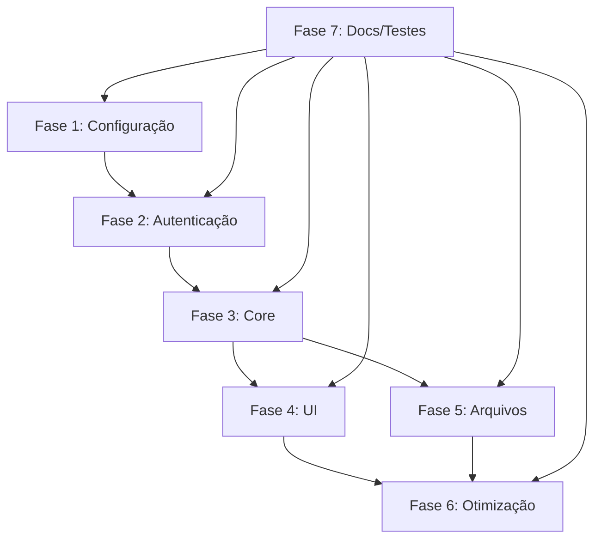

# Estrutura de Tasks do Projeto

## Fase 1: Configuração Inicial e Infraestrutura (Prioridade Alta)

### 1.1 Configuração do Repositório
- [Em Progresso - 07/06/2024] Criar repositório no GitHub
    - [x] Definir nome e descrição do repositório
    - [x] Escolher visibilidade (privado/público)
    - [x] Adicionar README.md inicial
    - [x] Adicionar licença (MIT, Apache, etc.)
    - [x] Configurar .gitignore
    - [ ] Inicializar repositório local e fazer o primeiro push
    - [x] Link: https://github.com/marcotasl/docling-converter
- [ ] Configurar branch protection rules
- [ ] Configurar GitHub Actions para CI/CD
- [ ] Configurar templates de PR e Issues
- [ ] Configurar dependabot para atualizações de segurança
- [ ] Criar estrutura inicial de diretórios
- [ ] Configurar .gitignore e .env.example

#### Status: Em Progresso
#### Data Início: 07/06/2024

### 1.2 Configuração do Ambiente de Desenvolvimento
- [ ] Configurar Next.js com TypeScript
- [ ] Configurar ESLint e Prettier
- [ ] Configurar Husky para pre-commit hooks
- [ ] Configurar Jest e React Testing Library
- [ ] Configurar Docker para desenvolvimento
- [ ] Configurar variáveis de ambiente

### 1.3 Configuração do Banco de Dados
- [ ] Configurar PostgreSQL local
- [ ] Implementar schema Prisma
- [ ] Criar migrations iniciais
- [ ] Configurar seed data para desenvolvimento
- [ ] Implementar backup automático

## Fase 2: Autenticação e Segurança (Prioridade Alta)

### 2.1 Implementação de Autenticação
- [ ] Configurar NextAuth.js
- [ ] Implementar login com email/senha
- [ ] Implementar autenticação social (Google, GitHub)
- [ ] Criar middleware de autenticação
- [ ] Implementar recuperação de senha
- [ ] Implementar verificação de email

### 2.2 Segurança
- [ ] Implementar rate limiting
- [ ] Configurar CORS
- [ ] Implementar validação de entrada
- [ ] Configurar headers de segurança
- [ ] Implementar logging de segurança
- [ ] Configurar WAF (Web Application Firewall)

## Fase 3: Funcionalidades Core (Prioridade Alta)

### 3.1 Upload de Documentos
- [ ] Implementar componente de drag-and-drop
- [ ] Implementar validação de tipos de arquivo
- [ ] Implementar validação de tamanho
- [ ] Configurar armazenamento S3
- [ ] Implementar progress bar
- [ ] Implementar tratamento de erros

### 3.2 Processamento de Documentos
- [ ] Integrar Docling API
- [ ] Implementar fila de processamento
- [ ] Criar workers para conversão
- [ ] Implementar sistema de retry
- [ ] Implementar monitoramento de status
- [ ] Implementar cache de resultados

## Fase 4: Interface do Usuário (Prioridade Média)

### 4.1 Layout e Design
- [ ] Criar design system
- [ ] Implementar tema claro/escuro
- [ ] Criar componentes base
- [ ] Implementar layout responsivo
- [ ] Implementar animações
- [ ] Otimizar performance

### 4.2 Funcionalidades de UI
- [ ] Implementar dashboard
- [ ] Criar página de histórico
- [ ] Implementar preview de documentos
- [ ] Criar sistema de notificações
- [ ] Implementar feedback visual
- [ ] Criar modais e overlays

## Fase 5: Gerenciamento de Arquivos (Prioridade Média)

### 5.1 Operações de Arquivo
- [ ] Implementar download de arquivos
- [ ] Criar sistema de compartilhamento
- [ ] Implementar exclusão de arquivos
- [ ] Criar sistema de organização
- [ ] Implementar busca de arquivos
- [ ] Criar sistema de tags

### 5.2 Histórico e Logs
- [ ] Implementar histórico de conversões
- [ ] Criar sistema de logs
- [ ] Implementar exportação de logs
- [ ] Criar dashboard de métricas
- [ ] Implementar alertas
- [ ] Criar relatórios

## Fase 6: Otimização e Monitoramento (Prioridade Baixa)

### 6.1 Performance
- [ ] Implementar cache
- [ ] Otimizar queries
- [ ] Implementar lazy loading
- [ ] Otimizar assets
- [ ] Implementar CDN
- [ ] Otimizar bundle size

### 6.2 Monitoramento
- [ ] Configurar Sentry
- [ ] Implementar analytics
- [ ] Criar dashboards
- [ ] Configurar alertas
- [ ] Implementar health checks
- [ ] Criar relatórios de uso

## Fase 7: Documentação e Testes (Contínuo)

### 7.1 Documentação
- [ ] Criar documentação técnica
- [ ] Escrever guia de contribuição
- [ ] Criar documentação de API
- [ ] Escrever guia de usuário
- [ ] Criar changelog
- [ ] Documentar arquitetura

### 7.2 Testes
- [ ] Implementar testes unitários
- [ ] Criar testes de integração
- [ ] Implementar testes E2E
- [ ] Configurar cobertura de testes
- [ ] Implementar testes de performance
- [ ] Criar testes de segurança

## Dependências entre Fases

## Observações Importantes

1. **Versionamento**:
   - Usar semantic versioning
   - Manter changelog atualizado
   - Seguir conventional commits

2. **Segurança**:
   - Revisões de código obrigatórias
   - Análise de segurança contínua
   - Atualizações de dependências regulares

3. **Qualidade**:
   - Manter cobertura de testes > 80%
   - Seguir padrões de código
   - Documentação sempre atualizada

4. **CI/CD**:
   - Testes automáticos em cada PR
   - Deploy automático em staging
   - Deploy manual em produção

5. **Monitoramento**:
   - Métricas de performance
   - Logs de erro
   - Uso de recursos
